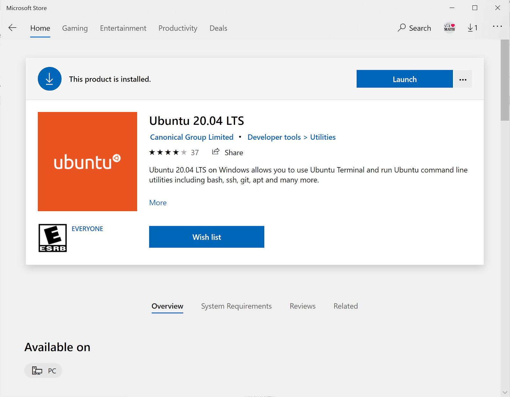
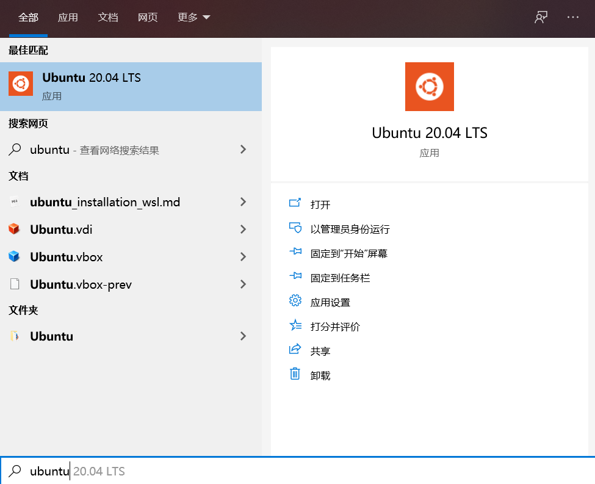

## How to install Ubuntu 18.04 LTS on VMware Fusion

### 1. Install the Windows Subsystem for Linux

- Right click on the `Win` button and choose to open *PowerShell* as Administrator.

  

- run:

  ```
  dism.exe /online /enable-feature /featurename:Microsoft-Windows-Subsystem-Linux /all /norestart
  ```

- Restart your computer.

  

### 2. Install your Linux distribution of choice

- Open the [Microsoft Store](https://aka.ms/wslstore) and select your favorite Linux distribution.

  

  

- The recommended version for VE280 FA2020 are **Ubuntu 18.04 LTS** and **Ubuntu 20.04 LTS** (both would be fine).

  The following links will open the Microsoft store page for each distribution:

  - [Ubuntu 16.04 LTS](https://www.microsoft.com/store/apps/9pjn388hp8c9)

  - [Ubuntu 18.04 LTS](https://www.microsoft.com/store/apps/9N9TNGVNDL3Q) (recommended)

  - [Ubuntu 20.04 LTS](https://www.microsoft.com/store/apps/9n6svws3rx71) (latest and recommended, approximately 440+MB)

    

- From the distribution's page, Click the blue “Get”
  button, and then click the blue “Install” button.
  
  After installing the product, your screen should look something like this.
  
  
  
  
  
  Click the blue “Launch” button to launch Ubuntu from the Microsoft Store.
  
  
  
- Ubuntu will go through a one-time installation automatically. When
  prompted, enter a username and password. The username and password
  do not need to be the same as your Windows username and password. 
  
  **The username and password are important for navigating your WSL file system and running Linux command-line tools, so don’t forget them!** For the rest of this guide, your WSL username will be referred to as {USER}, and your WSL password will be referred to as {PASSWORD}. Your Windows username will be referred to as {WINUSER}.
  
  


### 3. Enjoy your journey on Linux

+ After Ubuntu has completed its one-time installation, you can launch
  Ubuntu from several locations. 

  + Launch Ubuntu from the Microsoft Store as seen previously. 
  + Open the *PowerShell* and call the command `bash` .
  + Search for "Ubuntu" in the search bar at the bottom of your screen (or simply call `Win+S` and type in "Ubuntu") and click on the application that appears in the results. 

  

  

+ When you launch Ubuntu, you will start at the directory
  `~`, or `/home/{USER}`.

  This directory is located within the WSL file system. **If you choose to**
  **uninstall WSL, all files within the WSL file system, or all files at this**
  **directory, will be deleted.**  

+ If you wish to access your Windows file system from within Ubuntu, you can change directories by running the command

  ```
  cd /mnt/c/Users/{WINUSER}
  ```

  To return to your WSL file system, you can run the command `cd ~` or `cd /home/{USER}`

+ For other common commands for the Linux command line, please refer to [the first website in the Reference](https://ubuntu.com/tutorials/command-line-for-beginners#1-overview).

  To run `sudo` commands, you’ll need to enter your {PASSWORD} when prompted.


### Appendix: Troubleshooting installation

Below are related errors and suggested fixes. Refer to the [WSL troubleshooting page](https://docs.microsoft.com/zh-cn/windows/wsl/troubleshooting) for other common errors and their solutions.

- **Installation failed with error 0x80070003**
  - The Windows Subsystem for Linux only runs on your system drive (usually this is your `C:` drive). Make sure that distributions are stored on your system drive:
  
  - Open **Settings** -> **Storage** -> **More Storage Settings: Change where new content is saved** 
  
- **WslRegisterDistribution failed with error 0x8007019e**
  
  - The Windows Subsystem for Linux optional component is not enabled:
  
  - Open **Control Panel** -> **Programs and Features** -> **Turn Windows Feature on or off** -> Check **Windows Subsystem for Linux** or using the PowerShell cmdlet mentioned at the beginning of this article.
  
- **Installation failed with error 0x80070003 or error 0x80370102**
  
  - Please make sure that virtualization is enabled inside of your computer's BIOS. The instructions on how to do this will vary from computer to computer, and will most likely be under CPU related options.
  
- **The requested operation could not be completed due to a virtual disk system limitation. Virtual hard disk files must be uncompressed and unencrypted and must not be sparse.**
  - Deselect “Compress contents” (as well as “Encrypt contents” if that’s checked) by opening the profile folder for your Linux distribution. It should be located in a folder on your Windows file system, something like: `USERPROFILE%\AppData\Local\Packages\CanonicalGroupLimited...`
  - In this Linux distro profile, there should be a LocalState folder. Right-click this folder to display a menu of options. Select Properties > Advanced and then ensure that the “Compress contents to save disk space” and “Encrypt contents to secure data” checkboxes are unselected (not checked). If you are asked whether to apply this to just to the current folder or to all subfolders and files, select “just this folder” because you are only clearing the compress flag. After this, the `wsl –set-version` command should work.


- **The term 'wsl' is not recognized as the name of a cmdlet, function, script file, or operable program.**

  - Ensure that the [Windows Subsystem for Linux Optional Component is installed](https://docs.microsoft.com/zh-cn/windows/wsl/install-win10#enable-the-virtual-machine-platform-optional-component). Additionally, if you are using an ARM64 device and running this command from PowerShell, you will receive this error. Instead run `wsl.exe` from [PowerShell Core](https://docs.microsoft.com/zh-cn/powershell/scripting/install/installing-powershell-core-on-windows?view=powershell-6), or Command Prompt.

    

### Contact

This guide was written by [@PeterQiu0516](https://github.com/PeterQiu0516) on 09/02/2020. 

For any questions or issues, please contact peterqiu@umich.edu or check out the resources below.


### Reference

2. What is the Windows Subsystem for Linux?

   https://docs.microsoft.com/en-us/windows/wsl/about

3. Frequently Asked Questions about Windows Subsystem for Linux

   https://docs.microsoft.com/en-us/windows/wsl/faq

3. The Linux Command Line for Beginner

   https://ubuntu.com/tutorials/command-line-for-beginners#1-overview