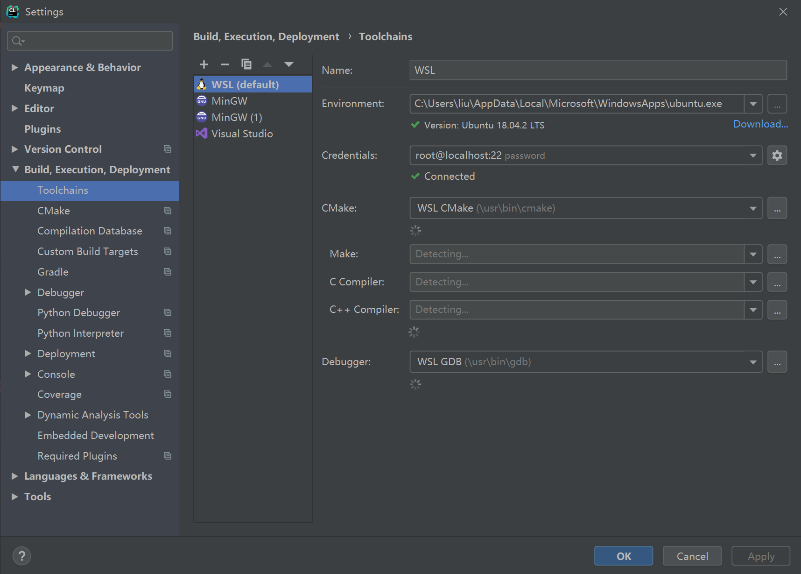
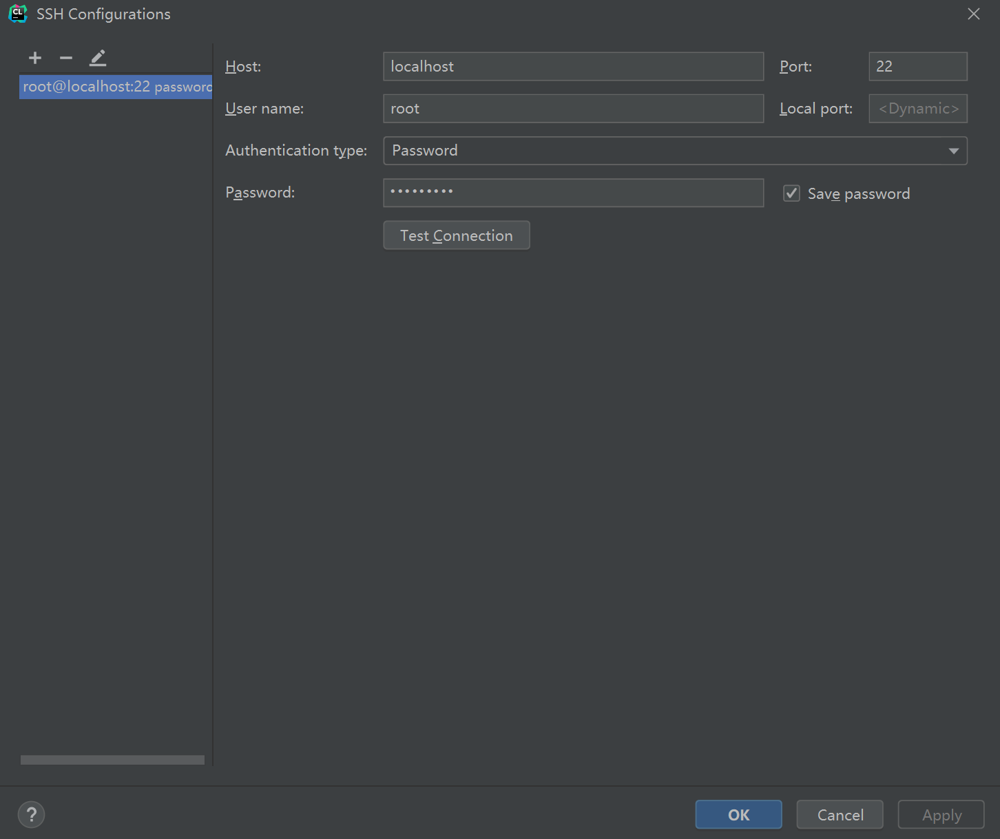
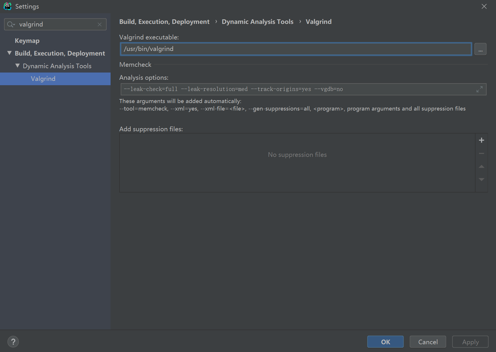

## How to install WSL (Windows Subsystem for Linux)

### Installation of WSL

Ensure that you are using an administrative shell. Press Win+X, you will find `Windows PowerShell (Administrator)`, and paste

```powershell
Enable-WindowsOptionalFeature -Online -FeatureName Microsoft-Windows-Subsystem-Linux
```

This will enable WSL as a service. Then you will be asked to reboot the system.

After the reboot, open the Windows Store and search for `Ubuntu` with a version, eg., 18.04, 20.04, and install it. You can also use other Linux Distributions, such as `Debian`, `openSUSE`, `Fedora`, and etc. However, these distributions won't be documented in this tutorial, so if it's your first time trying Linux, follow our official instructions on `Ubuntu`.

You can refer to https://docs.microsoft.com/en-us/windows/wsl/install-win10 if meeting any problems.


### Setup Apt Mirror

On `Debian` based systems, the package manager is called `apt`. You also need a superuser (administrator) privilege to install packages, so you need to use `sudo`, which means "superuser do".

The official repository of Debian / Ubuntu may be very slow, you can switch them to the [tuna mirror](https://mirror.tuna.tsinghua.edu.cn/help/ubuntu/).

Select the correct system version in the webpage above, and paste them into `/etc/apt/sources.list`.

For example, for Ubuntu 20.04, the lines will be

```
deb https://mirrors.tuna.tsinghua.edu.cn/ubuntu/ focal main restricted universe multiverse
# deb-src https://mirrors.tuna.tsinghua.edu.cn/ubuntu/ focal main restricted universe multiverse
deb https://mirrors.tuna.tsinghua.edu.cn/ubuntu/ focal-updates main restricted universe multiverse
# deb-src https://mirrors.tuna.tsinghua.edu.cn/ubuntu/ focal-updates main restricted universe multiverse
deb https://mirrors.tuna.tsinghua.edu.cn/ubuntu/ focal-backports main restricted universe multiverse
# deb-src https://mirrors.tuna.tsinghua.edu.cn/ubuntu/ focal-backports main restricted universe multiverse
deb https://mirrors.tuna.tsinghua.edu.cn/ubuntu/ focal-security main restricted universe multiverse
# deb-src https://mirrors.tuna.tsinghua.edu.cn/ubuntu/ focal-security main restricted universe multiverse

# deb https://mirrors.tuna.tsinghua.edu.cn/ubuntu/ focal-proposed main restricted universe multiverse
# deb-src https://mirrors.tuna.tsinghua.edu.cn/ubuntu/ focal-proposed main restricted universe multiverse
```

First, backup the `/etc/apt/sources.list` file

```bash
$ sudo mv /etc/apt/sources.list /etc/apt/sources.list.backup
```

Then you can use `vim` or `nano` to edit the file.

For `vim`, type `sudo vim /etc/apt/sources.list`. Then press `i`, and paste the lines **with mouse**. Finally press `Esc` and then `Shift+Z+Z` to save the file and exit the editor.

For `nano`, type `sudo nano /etc/apt/sources.list`. Then paste the lines **with mouse**. Then press `Ctrl+O` and then `Enter` to save the file. Finally press `Ctrl+X` to exit the editor.

After changing the source, you can install packages very fast. For example, if you want to install `g++`, simply type in

```bash
$ sudo apt update
$ sudo apt install g++
```


### Setup SSH Server (for remote compiling, etc)

The default SSH Server may not be configured correctly in WSL. You can check it by

```bash
$ sudo service ssh stop
$ sudo /usr/sbin/sshd -d
```

Check the startup logs and make sure HostKeys are available and you don't see log messages such as:

```
debug1: sshd version OpenSSH_7.2, OpenSSL 1.0.2g  1 Mar 2016
debug1: key_load_private: incorrect passphrase supplied to decrypt private key
debug1: key_load_public: No such file or directory
Could not load host key: /etc/ssh/ssh_host_rsa_key
debug1: key_load_private: No such file or directory
debug1: key_load_public: No such file or directory
Could not load host key: /etc/ssh/ssh_host_dsa_key
debug1: key_load_private: No such file or directory
debug1: key_load_public: No such file or directory
Could not load host key: /etc/ssh/ssh_host_ecdsa_key
debug1: key_load_private: No such file or directory
debug1: key_load_public: No such file or directory
Could not load host key: /etc/ssh/ssh_host_ed25519_key
```

If you do see such messages and the keys are missing under /etc/ssh/, you will have to regenerate the keys or just purge & install `openssh-server`:

```bash
$ sudo apt purge openssh-server
$ sudo apt install openssh-server
```

You may also need to configure the ssh server in `/etc/ssh/sshd_config` with `vi` or `nano` (use `sudo` for root privilege).

Find the lines
```
PermitRootLogin no/prohibit-password
PasswordAuthentication no
```

Change them to
```
PermitRootLogin yes
PasswordAuthentication yes
```

Remember to remove `#` if it exists in any of the two lines.

This will enable root login and password login which is usually useful.

Then
```bash
$ sudo service ssh restart
$ sudo service ssh status
```

If you want to login with root by password, you need to set a password first:
```bash
$ sudo passwd root
```

You should now be able to connect to WSL with any ssh client:
```bash
$ ssh root@localhost
```

#### CLion WSL Toolchain

You can use remote compiler toolchain in CLion. First, you should ensure `g++`, `cmake`, `gdb`, `valgrind` are installed on WSL:

```bash
$ sudo apt install g++ cmake gdb valgrind
```

Then configure the CLion Toolchains as shown in the image.



In the **Credentials**, you should enter the information about your ssh server configured.



Enter the password you set in the last step.

Furthermore, if you want to use `valgrind`, you should set the valgrind executable to `/usr/bin/valgrind` manually.




